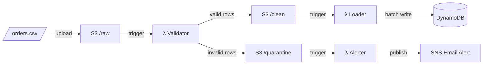

# 🍴 Golden Fork Pipeline

A serverless data ingestion pipeline that validates, loads, and monitors food delivery order data using AWS Lambda, S3, DynamoDB, and SNS — provisioned entirely with Terraform.

## Architecture



## How It Works

| Stage | Lambda | Trigger | Action |
|-------|--------|---------|--------|
| 1 | **Validator** | `s3://bucket/raw/*.csv` | Validates each row against business rules, splits output into `/clean` and `/quarantine` |
| 2 | **Loader** | `s3://bucket/clean/*.csv` | Batch-writes valid rows to DynamoDB (25 items/batch with retry) |
| 3 | **Alerter** | `s3://bucket/quarantine/*.csv` | Publishes failure summary to SNS for email notification |

## Validation Rules

- Customer ID and name required
- Delivery address required
- Order status must be one of: `delivered`, `cancelled`, `in_transit`, `preparing`
- Timestamp in ISO-8601 format (`YYYY-MM-DDTHH:MM:SS`)
- Financial fields non-negative; total ≤ £1000; delivery fee ≤ £20
- Item count must be a positive integer
- Driver rating (optional) between 1.0–5.0

## Tech Stack

- **Compute:** AWS Lambda (Python 3.12)
- **Storage:** S3 (versioned, encrypted, private)
- **Database:** DynamoDB (on-demand, PITR enabled)
- **Alerting:** SNS (email subscription)
- **Observability:** CloudWatch metrics + dashboard
- **Resilience:** SQS dead-letter queues for failed Lambda invocations
- **Analytics:** Athena + Glue catalog over quarantine data
- **IaC:** Terraform
- **Testing:** pytest + moto (local AWS mocking)
- **Tooling:** uv (package manager)

## Project Structure

```
golden-fork-pipeline/
├── lambda/
│   ├── validator/handler.py    # Lambda 1 — validate & split
│   ├── loader/handler.py       # Lambda 2 — load to DynamoDB
│   ├── alerter/handler.py      # Lambda 3 — SNS alert
│   └── shared/
│       ├── validators.py       # Row validation logic
│       └── dynamodb.py         # BatchWriteItem helper
├── terraform/
│   ├── main.tf                 # Core infrastructure
│   ├── observability.tf        # CloudWatch dashboard
│   ├── sqs.tf                  # Lambda dead-letter queues
│   ├── athena.tf               # Glue catalog + Athena workgroup
│   ├── variables.tf            # Input variables
│   ├── outputs.tf              # Useful outputs
│   └── terraform.tfvars.example
├── tests/
│   ├── test_validator_handler.py
│   ├── test_loader_handler.py
│   └── test_alerter_handler.py
├── Makefile
├── pyproject.toml
└── .gitignore
```

## Getting Started

### Prerequisites

- Python 3.12+
- [uv](https://docs.astral.sh/uv/) package manager
- Terraform ≥ 1.6
- AWS CLI configured with appropriate permissions

### Install & Test

```bash
make install          # Install all dependencies
make test             # Run test suite (13 tests, fully local)
make coverage         # Run with coverage report
```

### Deploy

```bash
cd terraform

# Copy the example and edit with your values (terraform.tfvars is gitignored)
cp terraform.tfvars.example terraform.tfvars

terraform init
terraform plan
terraform apply
```

After apply, check `terraform output` for the CloudWatch dashboard URL, Athena workgroup name, and sample SQL queries.

### Run the Pipeline

```bash
# Upload a CSV to trigger the pipeline
aws s3 cp orders.csv s3://your-bucket-name/raw/orders.csv
```

## Operations

### CloudWatch dashboard

The `golden-fork-pipeline` dashboard shows row counts, quarantine rate, loaded rows, and alert volume after each upload. Open it via:

```bash
terraform output cloudwatch_dashboard_url
```

### SQS dead-letter queues (DLQ)

Each Lambda has a dead-letter queue. If a Lambda **crashes** (unhandled exception, timeout) after AWS exhausts its async retry attempts, the failed S3 event payload is sent to the DLQ instead of being lost silently.

```bash
terraform output validator_dlq_url
aws sqs receive-message --queue-url "$(terraform output -raw validator_dlq_url)"
```

DLQs capture **infrastructure failures** (Lambda errors), not business-rule validation failures — those still go to S3 `quarantine/`.

### Query quarantine data with Athena

No need to download CSVs. In the Athena console (workgroup: `golden-fork-pipeline`):

```sql
SELECT validation_failures, COUNT(*) AS row_count
FROM golden-fork_pipeline.quarantine_orders
GROUP BY validation_failures
ORDER BY row_count DESC;
```

More sample queries: `terraform output athena_sample_queries`

## Testing

All tests run locally using [moto](https://github.com/getmoto/moto) to mock AWS services — no AWS account needed:

```bash
$ make test
========================= 13 passed in 3.26s =========================
```

## License

MIT
