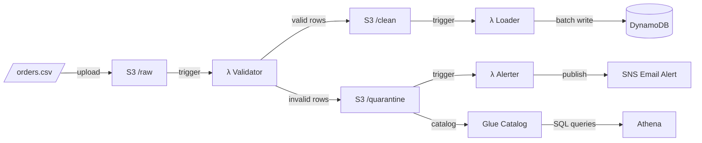

# 🍴 Golden Fork Pipeline

A serverless data ingestion pipeline that validates, loads, and monitors food delivery order data using AWS Lambda, S3, DynamoDB, and SNS — provisioned entirely with Terraform.

## Architecture



## How It Works

| Stage | Lambda | Trigger | Action |
|-------|--------|---------|--------|
| 1 | **Validator** | `s3://bucket/raw/*.csv` | Validates each row against business rules, splits output into `/clean` and `/quarantine` |
| 2 | **Loader** | `s3://bucket/clean/*.csv` | Batch-writes valid rows to DynamoDB (25 items/batch with retry) |
| 3 | **Alerter** | `s3://bucket/quarantine/*.csv` | Publishes structured failure summary to SNS for email notification |

## Validation Rules

Every row is checked against all of the following before being routed:

| Field | Rule |
|-------|------|
| `customer_id` | Required, non-empty |
| `customer_name` | Required, non-empty |
| `delivery_address` | Required, non-empty |
| `order_status` | Must be one of: `delivered`, `cancelled`, `in_transit`, `preparing` |
| `payment_method` | Must be one of: `card`, `cash`, `wallet`, `voucher` |
| `order_timestamp` | ISO-8601 format (`YYYY-MM-DDTHH:MM:SS`) |
| `subtotal_gbp` | Non-negative |
| `delivery_fee_gbp` | Non-negative, maximum £20 |
| `total_gbp` | Non-negative, maximum £1,000 |
| `item_count` | Positive integer (≥ 1) |
| `driver_rating` | Optional; if present, must be between 1.0 and 5.0 |

A row is quarantined if it fails **any** of the above. All failure reasons are appended as a `validation_failures` column so they can be queried with Athena.

## Tech Stack

| Layer | Technology |
|-------|------------|
| Compute | AWS Lambda (Python 3.12) |
| Storage | S3 (versioned, AES-256 encrypted, private) |
| Database | DynamoDB (on-demand billing, PITR enabled) |
| Alerting | SNS (email subscription) |
| Observability | CloudWatch custom metrics + dashboard |
| Resilience | SQS dead-letter queues per Lambda |
| Analytics | Athena + Glue catalog over `/quarantine` |
| IaC | Terraform ≥ 1.6 |
| Testing | pytest + moto (S3, DynamoDB, SNS mocked locally) |
| Tooling | uv |

## Project Structure

```
golden-fork-pipeline/
├── lambda/
│   ├── validator/handler.py    # Lambda 1 — validate & split
│   ├── loader/handler.py       # Lambda 2 — load to DynamoDB
│   ├── alerter/handler.py      # Lambda 3 — SNS alert
│   └── shared/
│       ├── validators.py       # Row validation logic
│       ├── dynamodb.py         # BatchWriteItem helper
│       └── metrics.py          # CloudWatch custom metrics
├── terraform/
│   ├── main.tf                 # Core infrastructure
│   ├── observability.tf        # CloudWatch dashboard
│   ├── sqs.tf                  # Lambda dead-letter queues
│   ├── athena.tf               # Glue catalog + Athena workgroup
│   ├── variables.tf            # Input variables
│   ├── outputs.tf              # Useful outputs
│   └── terraform.tfvars.example
├── tests/
│   ├── test_validator_handler.py
│   ├── test_loader_handler.py
│   └── test_alerter_handler.py
├── generate_orders.py          # Synthetic data generator (500 rows, ~18% dirty)
├── Makefile
├── pyproject.toml
└── .gitignore
```

## Getting Started

### Prerequisites

- Python 3.12+
- [uv](https://docs.astral.sh/uv/) package manager
- Terraform ≥ 1.6
- AWS CLI configured with appropriate permissions

### Install & Test

```bash
make install    # Install all dependencies including dev extras
make test       # Run the full test suite (fully local, no AWS account needed)
make coverage   # Run with coverage report
```

### Deploy

```bash
cd terraform

# Copy the example vars file and fill in your values (terraform.tfvars is gitignored)
cp terraform.tfvars.example terraform.tfvars

terraform init
terraform plan
terraform apply
```

After `apply`, run `terraform output` to retrieve:

- The CloudWatch dashboard URL
- The Athena workgroup name and sample SQL queries
- The S3 upload command
- DLQ URLs for each Lambda

### Generate Synthetic Data

```bash
make generate   # Produces orders.csv — 500 rows, ~18% intentionally dirty, seed 42
```

Dirty rows cover: null customer IDs, negative financials, invalid order statuses, malformed timestamps, out-of-range driver ratings, zero item counts, and missing delivery addresses.

### Run the Pipeline

```bash
aws s3 cp orders.csv s3://your-bucket-name/raw/orders.csv
```

The upload triggers the Validator automatically. Clean rows flow to DynamoDB via the Loader; quarantined rows trigger an SNS email alert via the Alerter.

## Operations

### CloudWatch Dashboard

The `golden-fork-pipeline` dashboard shows total rows, clean rows, quarantine rows, quarantine rate (%), loaded rows, and alert volume — one data point per upload.

```bash
terraform output cloudwatch_dashboard_url
```

### SQS Dead-Letter Queues

Each Lambda has its own DLQ. When a Lambda **crashes** (unhandled exception or timeout) after AWS exhausts its async retry attempts, the failed S3 event payload is routed to the DLQ rather than silently dropped.

> DLQs capture **infrastructure failures** (Lambda errors). Business-rule validation failures are a separate concern — those rows are intentionally routed to S3 `/quarantine`.

```bash
# Check for failed events
aws sqs receive-message --queue-url "$(terraform output -raw validator_dlq_url)"
aws sqs receive-message --queue-url "$(terraform output -raw loader_dlq_url)"
aws sqs receive-message --queue-url "$(terraform output -raw alerter_dlq_url)"
```

DLQ message retention is set to 14 days.

### Query Quarantine Data with Athena

The Glue catalog exposes `/quarantine` as an external table so you can query failure patterns with SQL — no CSV downloads required.

Open the Athena console, select workgroup `golden-fork-pipeline`, and run:

```sql
-- Failure breakdown by category
SELECT validation_failures, COUNT(*) AS row_count
FROM golden-fork_pipeline.quarantine_orders
GROUP BY validation_failures
ORDER BY row_count DESC;

-- Sample quarantined rows
SELECT order_id, customer_id, order_status, validation_failures
FROM golden-fork_pipeline.quarantine_orders
LIMIT 20;
```

More sample queries are available via:

```bash
terraform output athena_sample_queries
```

## Testing

All tests run locally using [moto](https://github.com/getmoto/moto) to mock S3, DynamoDB, and SNS — no AWS credentials or live resources required.

```bash
$ make test
========================= 13 passed in 3.26s =========================
```

Each Lambda handler is loaded in isolation via `importlib` to prevent module state leaking between test classes.

## License

MIT